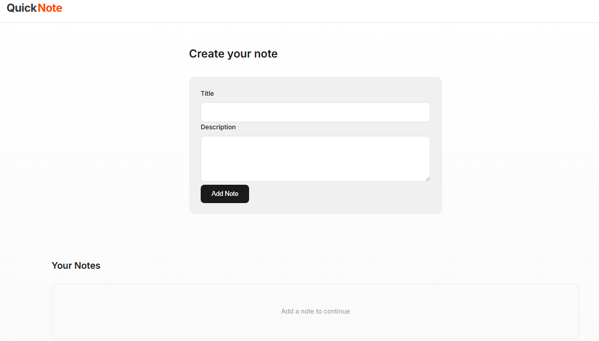

# QuickNote

A modern note-taking application built with React and Vite. QuickNote allows users to create, edit, and delete notes, with all data automatically saved in the browser using localStorage.

## Features

- 📝 Create new notes
- 📖 View saved notes
- ✏️ Edit existing notes
- 🗑️ Delete notes with confirmation
- 💾 Persistent data storage using localStorage
- ⚛️ Built with reusable React components
- 🔄 React Hooks (`useState` and `useEffect`) for state and lifecycle management
- 📱 Responsive user interface

## Screenshot



## Tech Stack

- React
- Vite
- JavaScript (ES6+)
- CSS3
- localStorage

## Getting Started

Clone the repository:

```bash
git clone https://github.com/hnlxyz/quicknote.git
```

Navigate to the project folder:

```bash
cd quicknote
```

Install dependencies:

```bash
npm install
```

Start the development server:

```bash
npm run dev
```

Open your browser:

```
http://localhost:5173
```

## Project Structure

```
src/
├── components/
├── App.jsx
├── main.jsx
└── index.css
```

## Learning Reference

This project was developed as part of my React learning journey through online resources and hands-on practice. The application was enhanced with additional functionality, including note editing and delete confirmation, to improve the overall user experience.

## Author

**Htun Naing Lynn**

- GitHub: https://github.com/hnlxyz
- LinkedIn: https://www.linkedin.com/in/htun-naing-lynn-67871a14/